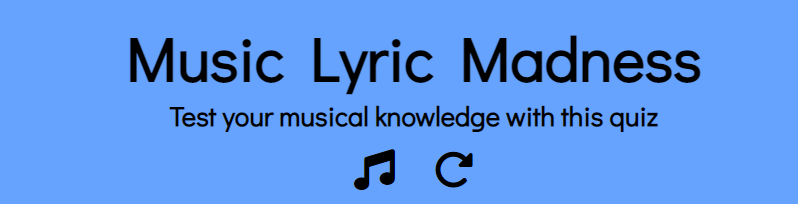

# Music Lyric Madness

[Live site](https://emmygood.github.io/music-lyric-madness/)

## Introduction

Music Lyric Madness is an interactive general knowledge music quiz game. The aim of this game is for the user to select the correct answer to the question from the multiple choice selection. The questions are a mixture of difficulties, with songs ranging from all eras of music. The user is shown a lyric from a song, and must guess the correct name of the song, that the lyric is from. Each question will have four multiple choice answers for the user to choose from. The user is shown their score as they move along through the ten questions.

---

## UX

### Color Scheme

As Music Lyric Madness is a quiz game based on music, I chose the background to be full of music notes. I didn't want the background to be too busy, so I stuck with black and white colors for this. The aim of this is so that when the user opens up the site they will have a general idea of what the theme of this quiz is. This background is consistent across all devices.
I wanted the game itself to be inside a box over the top of the background, as this made the content easier to see. To juxtapose against the simple background colors, I went with paler versions; of blue and pink, so it was not too overpowering. Then I kept the text simple, being black, as this is easy to read against the blue and pink.
When the answer is chosen, I wanted the user to easily see which one is correct and which are incorrect. Therefore I chose a red and and a green, to change the font and border color. I used [coolors.co](https://coolors.co/ff8080-cc0000-66a3ff-004d00) to generate my color palette.

- #66a3ff used for the content box
- #ff8080 used for the buttons, and footer
- hsl(120, 100%, 15%) used for the button font and border, when answer is correct
- hsl(0, 100%, 40%) used for the button font and border, when answer is incorrect
- #000000 used for all font and icons
- #ffffff used for button:hover 

### Typography 

[Google Fonts](https://fonts.google.com/) was imported to select all the fonts. With sans-serif as a fallback for Didact Gothic. I just had the one font to keep consistency throughout the site. This font is clear and easy to read, making sure accessibility was a priority. 

- [Didact Gothic](https://fonts.google.com/specimen/Didact+Gothic?query=Didact+Gothic) used for all font across the site

- [Font Awesome](https://fontawesome.com/) icons used throughout the site including, the music note logo icon, and the refresh button, and the social media icons in the footer.

---

## User Stories

### Audience 
- People looking for a quick and fun game to play.
- People looking to be able to play the game with others.
- People of all ages engaging in answering the questions, which are of all difficulties.
- People that have a love of music, to be able to put their knowledge to the test.

### New Site Users
- As a new site user, I would like to gain a quick understanding of the theme of the game, so I can decide if I know enough to play.
- As a new site user, I would like to know what the game invloves, so that I can decide if I have enough time.
- As a new site user, I would like to play the game of multiple devices.
- As a new site user, I would like to follow simple, easy to follow rules of the game, so I can navigate throught the questions quickly.
- As a new site user, I would like to have fun, playing a general knowledge quiz.

### Returning Users
- As a returning user, I want to be able to see what my score is, so that I can beat it from last time.
- As a returning user, I want some kind of feedback at the end, so I know how well or bad I have done.
- As a returning user, I want to be able to start the game quickly, as I have already played before.

### Site Admin 
- As a site administrator, I want people to have clear, simple instructions on how to play.
- As a site administrator, I should be able to appeal to a wide demographic, with a range of questions.
- As a site administrator, I want the user to be able to view their scores and get feedback.

---

## Features
### Common Features

#### Logo and heading
- The name of the game along with the heading remain the same when playing the game and also do not change when played on different screen sizes. I purposley did not want this too big, as I wanted the questions to be the forefront of the game.
- The heading gives the user more information about what the quiz is about.
- The font Awesome music note icon, is consistant when playing the game. It is a quick indicator for the user as to what the game is about.
- When the game has started, and the user moves onto the first question, the refresh icon will appear. This is included to give the user the chance to return to the home page if they decide they want to start again, or re-read the instructions. 

