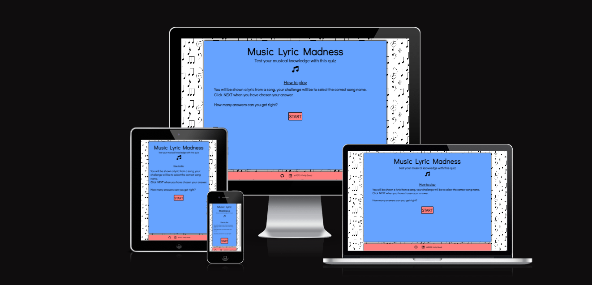

# Music Lyric Madness

[Live site](https://emmygood.github.io/music-lyric-madness/)

## Introduction

Music Lyric Madness is an interactive general knowledge music quiz game. The aim of this game is for the user to select the correct answer to the question from the multiple choice selection. The questions are a mixture of difficulties, with songs ranging from all eras of music. The user is shown a lyric from a song, and must guess the correct name of the song, that the lyric is from. Each question will have four multiple choice answers for the user to choose from. The user is shown their score as they move along through the questions.

## UX

### Color Scheme

As Music Lyric Madness is a quiz game based on music, I chose the background to be full of music notes. I didn't want the background to be too busy, so I stuck with black and white colors for this. The aim of this is so that when the user opens up the site they will have a general idea of what the theme of this quiz is. This background is consistent across all devices.
I wanted the game itself to be inside a box over the top of the background, as this made the content easier to see. To juxtapose against the simple background colors, I went with paler versions; of blue and pink, so it was not too overpowering. Then I kept the text simple, being black, as this is easy to read against the blue and pink.
When the answer is chosen, I wanted the user to easily see which one is correct and which are incorrect. Therefore I chose a red and and a green, to change the font and border color. I used [coolors.co](https://coolors.co/ff8080-cc0000-66a3ff-004d00) to generate my color palette.

- #66a3ff used for the content box
- #ff8080 used for the buttons, and footer
- hsl(120, 100%, 15%) used for the button font and border, when answer is correct
- hsl(0, 100%, 40%) used for the button font and border, when answer is incorrect
- #000000 used for all font and icons
- #ffffff used for button:hover 
