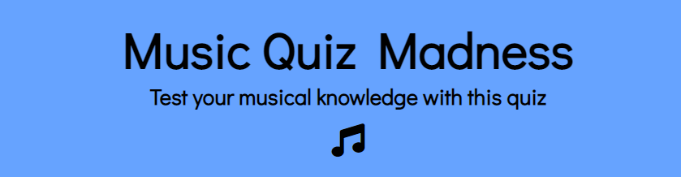
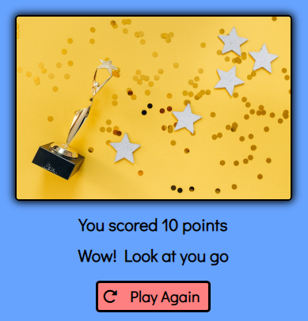
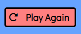

# Music Quiz Madness

[Live site](https://emmygood.github.io/music-lyric-madness/)

## Introduction

Music Quiz Madness is an interactive general knowledge music quiz game. The aim of this game is for the user to select the correct answer to the question from the multiple choice selection. The questions are a mixture of difficulties, with songs ranging from all eras of music. The user is shown a question from music trivia, and must guess the correct answer to the question. Each question will have four multiple choice answers for the user to choose from. The user is shown their score as they move along through the ten questions, and will recieve feedback of their final score at the end.

---

## UX

### Color Scheme

- The background is full of music notes as this is what the game is based on. I didn't want the background to be too busy, so I stuck with black and white colors for this. 
- The game itself is inside a box overlapping the background, as this made the content easier to see. 
- To juxtapose against the simple background colors, I went with paler versions; of blue and pink, so it was not too overpowering. Then I kept the text simple, being black, as this is easy to read against the blue and pink.
- When the answer is chosen, I wanted the user to easily see which one is correct and which are incorrect. Therefore I chose a red and and a green, to change the font and border color. I used [coolors.co](https://coolors.co/ff8080-cc0000-66a3ff-004d00) to generate my color palette.

  - `#66a3ff` used for the content box
  - `#ff8080` used for the buttons, and footer
  - `hsl(120, 100%, 15%)` used for the button font and border, when answer is correct
  - `hsl(0, 100%, 40%)` used for the button font and border, when answer is incorrect
  - `#000000` used for all font and icons
  - `#ffffff` used for button:hover 

### Typography 

[Google Fonts](https://fonts.google.com/) was imported to select all the fonts. With sans-serif as a fallback for Didact Gothic. I just had the one font to keep consistency throughout the site. This font is clear and easy to read, making sure accessibility was a priority. 

- [Didact Gothic](https://fonts.google.com/specimen/Didact+Gothic?query=Didact+Gothic) used for all font across the site

- [Font Awesome](https://fontawesome.com/) icons used throughout the site including, the music note logo icon, and the refresh button, and the social media icons in the footer.

---

## User Stories

### Audience 
- People looking for a quick and fun game to play.
- People looking to be able to play the game with others.
- People of all ages engaging in answering the questions, which are of all difficulties.
- People that have a love of music, to be able to put their knowledge to the test.

### New Site Users
- As a new site user, I would like to gain a quick understanding of the theme of the game, so I can decide if I know enough to play.
- As a new site user, I would like to know what the game invloves, so that I can decide if I have enough time.
- As a new site user, I would like to play the game of multiple devices.
- As a new site user, I would like to follow simple, easy to follow rules of the game, so I can navigate throught the questions quickly.
- As a new site user, I would like to have fun, playing a general knowledge quiz.

### Returning Users
- As a returning user, I want to be able to see what my score is, so that I can beat it from last time.
- As a returning user, I want some kind of feedback at the end, so I know how well or bad I have done.
- As a returning user, I want to be able to start the game quickly, as I have already played before.

### Site Admin 
- As a site administrator, I want people to have clear, simple instructions on how to play.
- As a site administrator, I should be able to appeal to a wide demographic, with a range of questions.
- As a site administrator, I want the user to be able to view their scores and get feedback.

---

## Features
### Common Features

#### Background and Favicon

- As Music Quiz Madness is a quiz game based on music, I wanted the background to reflect this. 
- In order for the background to not distract from the game itself, the colors are simple black and white.
- The aim of this is so that when the user opens up the site they will have a general idea of what the theme of this quiz is. This background is consistent across all devices.
- The favicon will help users to know that this is the correct site they're looking for, improving site SEO.

#### Logo and heading

- The name of the game along with the heading remain the same when playing the game, and also do not change when played on different screen sizes. This is purposley not too big, as I wanted the questions to be the forefront of the game.
- The heading gives the user more information about what the quiz is about.
- The font Awesome music note icon, is consistant when playing the game. It is a quick indicator for the user as to what the game is about.
- When the game has started, and the user moves onto the first question, the refresh icon will appear, next to the music note. This is included to give the user the chance to return to the home page if they decide they want to start again, or re-read the instructions. 

#### Footer

- The footer is separate from the game area, so it is not in the way or distracting to the user when playing.
- The footer contains the copyright and social media links which are displayed as font awesome icons.
- It is the same width as the game area box to keep the theme consistant but to separate it from the game it is in the color #ff8080. 
- It is consistent across all devices, giving the user easier access to find them.

#### How To Play Area

- The how to play area, is situated under the heading and icons of the home page. Consisting of easy to follow and quick to read steps on how to play the game.
- This area is useful for the user so they know what to expect and always have a point to refer back to if needed.
- This area is hidden once the game is started.
- When the game is started, the refresh icon will appear, once clicked it takes you back to this page, where the instructions are displayed. 

#### Start Button

- The start button is displayed underneath the how to play instructions. So once the user has read the steps they can get straight on and begin the game. This is the case across all devices.
- In order for the button to stand out against the blue, it is in the color #ff8080. When the user hovers over the button, the border will turn white #ffffff to let the user know they should click on that button.
- When the game has started this button is hidden.

#### Question and Answers

- When the user clicks the start button the first question appears in place of the instructions.
- The questions are numbered to give the user insight into what number they are on.
- The questions will never appear in the same order, they are shuffled every game.
- There are four multiple choice answers, for the user to choose from.
- When hovered over, each button outline will turn white #ffffff to indicate it is clickable.
- Once the answer is chosen, the correct answer will turn green hsl(120, 100%, 15%), leaving the incorrect answers to tun red hsl(0, 100%, 40%). This is giving immediate feedback to the user which should make them continue to play because it means they do not have to wait until the end to recieve the correct answer.
- This section is responsive to any device.

#### Score Area and Next Button

- This is visible as soon as the game has started.
- When the player selects their answer, the score area will update by one, to either the correct answer or the incorrect answer. This feedback givien to the user will make them want to improve upon their score and keep  playing.
- The next button is only visible when an answer is selected, this is so the user cannot skip a question and to give control to the user.

#### End Game

- After the ten questions are completed, the quiz will end and the user is shown their score.
- Along with the score, there will be an image and message that matches the score they got.
- There are three different pictures the user could get depending on their final score:
  - If they recieved 4 points or less
  - Between 5 and 7
  - More than 7. This feedback will give the user intentive to re-take the quiz or compare with others.
- The option to play the game again, is shown here. Using the same refresh icon as before, to keep consistency. This button takes the user back to the home page, and back to the start button giving them another go.

 
 

### Future Features

- A timer feature
  - So the user plays against a clock, which will add extra pressure.
- More questions
  - Again, adding pressure to get more than ten right.
- Different eras of music
  - The ability for the user to choose what specific era of music they want to be quizzed on. Which means the quiz will attract a wider demographic.

---

## Tools and Technologies Used

- [HTML](https://en.wikipedia.org/wiki/HTML) Used for the main site content.
- [CSS](https://en.wikipedia.org/wiki/CSS) Used for the site design as well as layout.
- [CSS Flexbox](https://www.w3schools.com/css/css3_flexbox.asp) Used to enhance the responsive layout.
- [JavaScript](https://www.javascript.com) Used for the interaction on the site.
- [Git](https://git-scm.com) Used for version control. (git add, git commit, git push)
- [GitHub](https://github.com) used for secure online code storage.
- [GitHub Pages](https://pages.github.com) used for hosting the deployed front-end site.
- [Markdown Builder](https://traveltimn.github.io/markdown-builder/) by Tim Nelson used to help generate the Markdown files.
- [Python Tutor](https://pythontutor.com/visualize.html#mode=edit) To visualise the execution of the javascript code.

---
## Testing

I have tested the site on different browsers (Chrome, Firefox, Safari) as well as different screen sizes (laptop, tablet and smartphone) to test the responsivness. As well as this, I tested the site with development tools, whilst in the building stages, to ensure the responsivness of the site across different devices.

### HTML Validaton

I have used the recommended [HTML W3C Validator](https://validator.w3.org) to validate all of my HTML files.

- Home - [W3C](https://validator.w3.org/nu/?doc=https%3A%2F%2Femmygood.github.io%2Fmusic-quiz-madness%2F) Lack of headings h2-h6. I am aware of this warning, however this section is for the control buttons, therefore they do not need to be headings. This does not effect the final look of the site in the browsers.

- Game - [W3C](https://validator.w3.org/nu/?doc=https%3A%2F%2Femmygood.github.io%2Fmusic-quiz-madness%2Findex.html)
Lack of headings h2-h6. Same warning again for the same buttons, but I am leaving them as they are because they are not headings.

 

- End Game - [W3C](https://validator.w3.org/nu/?doc=https%3A%2F%2Femmygood.github.io%2Fmusic-quiz-madness%2Fend.html)
Lack of headings h2-h6. And again for the same buttons, but I am leaving them as they are because they are not headings.

### CSS 

I have used the recommended [CSS Jigsaw Validator](https://jigsaw.w3.org/css-validator) to validate all of my CSS files.

- Pass: No Errors [W3C](https://jigsaw.w3.org/css-validator/validator?uri=https%3A%2F%2Femmygood.github.io%2Fmusic-quiz-madness%2Findex.html&profile=css3svg&usermedium=all&warning=1&vextwarning=&lang=en)

### Javascript

I have used the recommended [JShint Validator](https://jshint.com) to validate all of my JS files.

- Script js file - Unused variables from external files, coming from the questions.js file

- Questions js file - Unused variables from external files

- End js file - Pass: No Errors

## Responsivness 

I have used the Wave Web Accessibility Evaluation Tool to make sure the site is accessible for all. All pages passed with no errors. Here are the results below.

- [Wave Link Home](https://wave.webaim.org/report#/https://emmygood.github.io/music-quiz-madness/index.html)

- [Wave Link End](https://wave.webaim.org/report#/https://emmygood.github.io/music-quiz-madness/end.html)

## Compatability 

