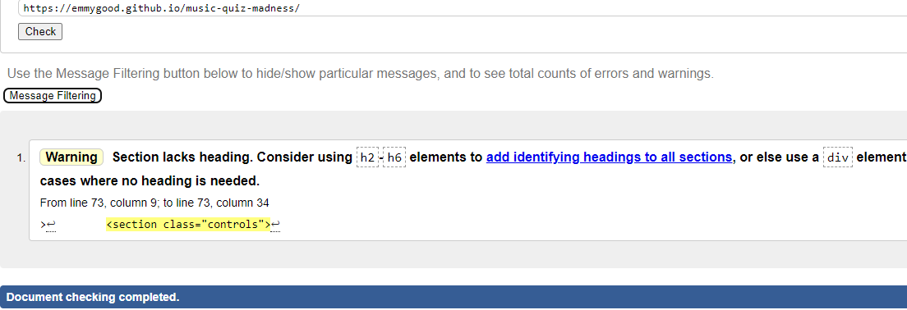
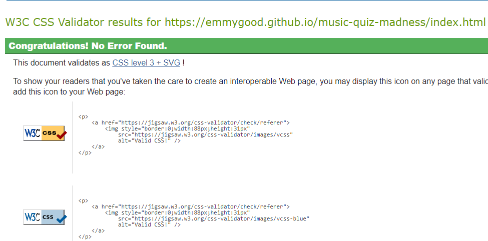
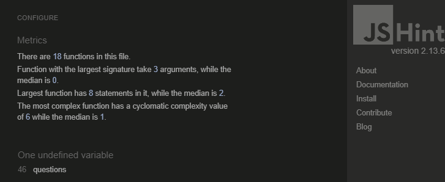
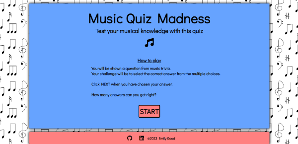
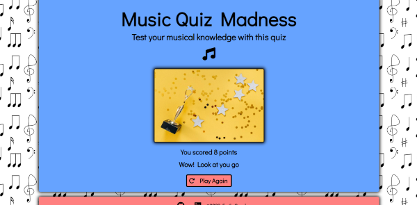
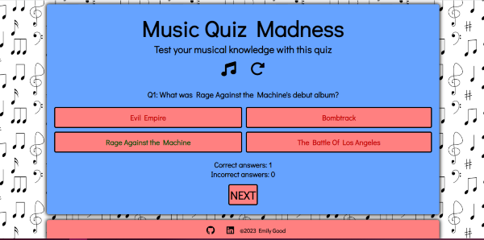
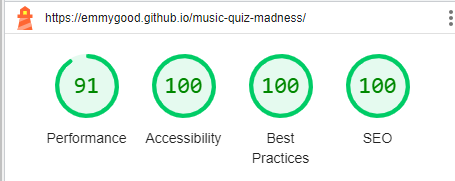

# Testing

Return back to the [README.md](README.md) file.

---

## Code Validation

### HTML Validaton

I have used the recommended [HTML W3C Validator](https://validator.w3.org) to validate all of my HTML files.

| Page | W3C URL | Screenshot | Notes |
| --- | --- | --- | --- |
| index.html | [W3C](https://validator.w3.org/nu/?doc=https%3A%2F%2Femmygood.github.io%2Fmusic-quiz-madness%2Findex.html) |  | Section lacks header h2-h6 warning |
| end.html | [W3C](https://validator.w3.org/nu/?doc=https%3A%2F%2Femmygood.github.io%2Fmusic-quiz-madness%2Fend.html) |  | Section lacks header h2-h6 warning |

---

### CSS

I have used the recommended [CSS Jigsaw Validator](https://jigsaw.w3.org/css-validator) to validate all of my CSS files.

| File | Jigsaw URL | Screenshot | Notes |
| --- | --- | --- | --- |
| style.css | [Jigsaw](https://jigsaw.w3.org/css-validator/validator?uri=https%3A%2F%2Femmygood.github.io%2Fmusic-quiz-madness) |  | Pass: No Errors |

---

### JavaScript

I have used the recommended [JShint Validator](https://jshint.com) to validate all of my JS files.

| File | Screenshot | Notes |
| --- | --- | --- |
| script.js |  | Unused variables from external files |
| questions.js |  | Unused variables from external files |
| end.js |  | Pass: No Errors |

---

## Responsivness 

I have used the Wave Web Accessibility Evaluation Tool to make sure the site is accessible for all. All pages passed with no errors. Here are the results below.

- [Wave Link Home](https://wave.webaim.org/report#/https://emmygood.github.io/music-quiz-madness/index.html)

- [Wave Link End](https://wave.webaim.org/report#/https://emmygood.github.io/music-quiz-madness/end.html)

---

## Compatability 

I have tested the site on different browsers (Chrome, Firefox, Safari) as well as different screen sizes (laptop, tablet and smartphone) to test the responsivness. As well as this, I tested the site with development tools, whilst in the building stages, to ensure the responsivness of the site across different devices.

I tested the site on different devices to test the compatability. I tested it on my smartphone (samsung screenshots shown below) and was very pleased with how everything responded. As well as testing it on my desktop to see how it responded to a larger screen size (also shown below), which also responded well.

| Device | Screenshot | Notes |
| --- | --- | --- |
| Mobile (DevTools) |  | Works as expected |
|                   |  |
|                   |  |
| Desktop           |   | Works as expected |
|                   |   |                   |
|                   |    |                   |

---

## Lighthouse Audit

I've tested my deployed project using the Lighthouse Audit tool to check for any major issues. For mobile, the response times were a fair bit slower, so I reduced the image sizes on [Convertio](https://convertio.co/), from jpg to jpeg. I then tested it again and got a much better score.

| Page | Size | Screenshot | Notes |
| --- | --- | --- | --- |
| Home | Mobile |  | Slower response time due to large images |
| Home | Desktop |  | No warnings |
| End | Mobile |  | Some minor warnings |
| End | Desktop |  | No major warnings |

---

## Bugs

- Js Uncaught Reference error: element is not defined
 
     

     To fix this, I made sure that the element was defined in the clearQuizClass function as it's parameter, which was what was missing. This then meant that the setQuizClass function could work properly.

- Js Uncaught Type error: cannot read properties of undefined
    
     

     To fix this, in order for the buttons to append into the correct place, I had to make sure the displayQuestion function was targetting the correct class from the html, which is buttons. This then appended the answer buttons into the button elements. As well as making the next button appear.

- Js Uncaught Syntax error: missing initialiser in const declaration

     

     To fix this, I checked the variable it was refering to, questionsShuffled. This actually needed to change to a let variable in order for the function to work properly.

- Js Failed to load resource

     

     To fix this issue, I created my own [favicon](https://www.favicon.cc/) that is inline with the theme of the game. This also helps to give the site better SEO.

## Defensive Programming

Defensive programming was manually tested with the below user acceptance testing:

| Page | User Action | Expected Result | Pass/Fail | Comments |
| --- | --- | --- | --- | --- |
| Home Page | | | | |
| | Click on start | Begin the quiz at question one and refresh button appears | Pass | Takes you to the first question |
| | Click social media links in footer | Link opens in new tab  | Pass | Once clicked, you're directed to the linked page in a new tab |
| Quiz Page | | | | |
| | Click on an answer button correct | Button turns green, increment score by one  | Pass | If the answer the user clicked, is correct it turns green, leaving all other buttons to turn red. Incrementing score correct area. Next button appears |
| | Click on answer button incorrect | Button turns red, increment score by one | Pass | If the button clicked is incorrect, the button turns red, the other three buttons turn either green or red. Incrementing score incorrect area. Next button appears |
| | Click on Next button | Go to next question | Pass | When clicked the user is moved onto the next question. Next button is then hidden until an answer is chosen |
| | Click on last question | Redirection to end quiz page. Image, message and final score | Pass | When question ten is complete, you're redirected to the end page where the user is shown their final score, along with one of three images and messages that represents this |
| | Click on Play again | Takes you back to the home page | Pass | If the user wants to play again, they can press the play again button and return to the homepage, to where the start button is |
