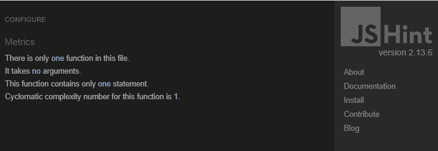

# Testing

Return back to the [README.md](README.md) file.

## Code Validation

### HTML Validaton

I have used the recommended [HTML W3C Validator](https://validator.w3.org) to validate all of my HTML files.

| Page | W3C URL | Screenshot | Notes |
| --- | --- | --- | --- |
| index.html | [W3C](https://validator.w3.org/nu/?doc=https%3A%2F%2Femmygood.github.io%2Fmusic-quiz-madness%2Findex.html) |  | Section lacks header h2-h6 warning |
| end.html | [W3C](https://validator.w3.org/nu/?doc=https%3A%2F%2Femmygood.github.io%2Fmusic-quiz-madness%2Fend.html) |  | Section lacks header h2-h6 warning |

---

### CSS

I have used the recommended [CSS Jigsaw Validator](https://jigsaw.w3.org/css-validator) to validate all of my CSS files.

| File | Jigsaw URL | Screenshot | Notes |
| --- | --- | --- | --- |
| style.css | [Jigsaw](https://jigsaw.w3.org/css-validator/validator?uri=https%3A%2F%2Femmygood.github.io%2Fmusic-quiz-madness) |  | Pass: No Errors |

---

### JavaScript

I have used the recommended [JShint Validator](https://jshint.com) to validate all of my JS files.

| File | Screenshot | Notes |
| --- | --- | --- |
| script.js |  | Unused variables from external files |
| questions.js |  | Unused variables from external files |
| end.js |  | Pass: No Errors |

---

## Responsivness 

I have used the Wave Web Accessibility Evaluation Tool to make sure the site is accessible for all. All pages passed with no errors. Here are the results below.

- [Wave Link Home](https://wave.webaim.org/report#/https://emmygood.github.io/music-quiz-madness/index.html)

- [Wave Link End](https://wave.webaim.org/report#/https://emmygood.github.io/music-quiz-madness/end.html)

## Compatability 

I have tested the site on different browsers (Chrome, Firefox, Safari) as well as different screen sizes (laptop, tablet and smartphone) to test the responsivness. As well as this, I tested the site with development tools, whilst in the building stages, to ensure the responsivness of the site across different devices.

I tested the site on different devices to set the compatability. I tested it on my smartphone (samsung) and was very pleased with how everything responded. As well as testing it on my laptop to see how it responded to a larger screen size.

| Device | Screenshot | Notes |
| --- | --- | --- |
| Mobile (DevTools) |  | Works as expected |
|                   |  |
|                   |  |

